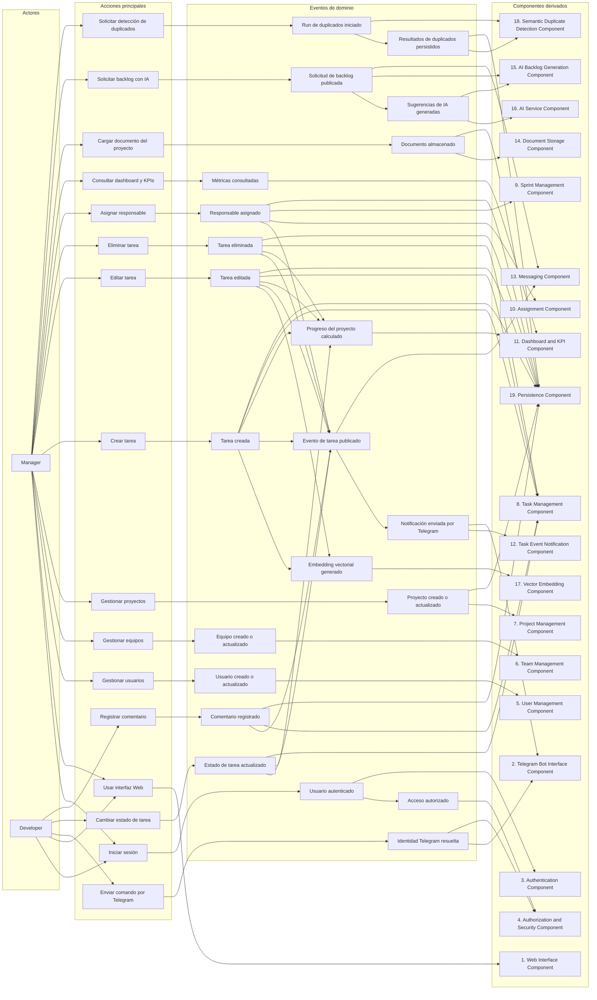
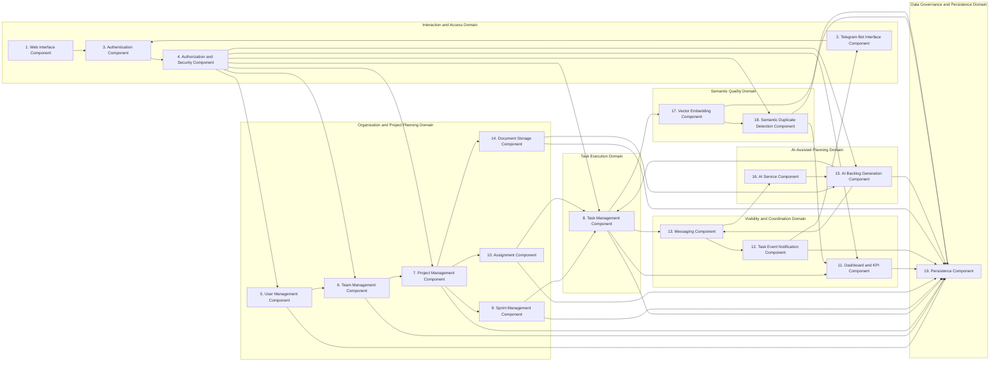
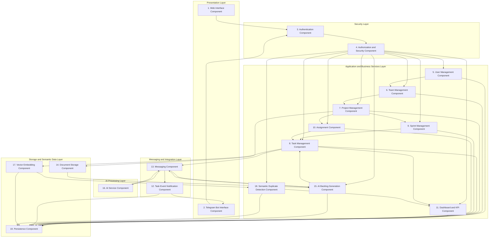

# Component-Based Thinking: Oracle Java Bot

## 1. Introducción y alcance del documento

Este documento presenta una primera identificación de componentes para el sistema **Oracle Java Bot**, aplicando pensamiento basado en componentes y utilizando **Event Storming** como método principal de análisis arquitectónico.

El objetivo del documento es conectar los requisitos funcionales, atributos de calidad y flujos reales del sistema con una propuesta inicial de componentes. Esta identificación no busca describir clases, métodos o detalles internos de implementación, sino definir unidades arquitectónicas con responsabilidades claras, bajo acoplamiento y alta cohesión.

Oracle Java Bot es una plataforma de gestión de proyectos y tareas para equipos de desarrollo de software. El sistema integra una interfaz Web, un bot de Telegram, un backend Spring Boot, mensajería Kafka, servicios de inteligencia artificial, almacenamiento de documentos y una base de datos Oracle como fuente principal de persistencia y trazabilidad.

El alcance de este documento incluye:

- La identificación de componentes mediante **Event Storming**.
- La relación entre actores, eventos, acciones y componentes.
- La definición de responsabilidades por componente.
- Una vista de **particionamiento técnico** de la arquitectura.
- Una vista de **particionamiento por dominio** de la arquitectura.

## 2. Component Identification process and rationale

Para identificar los componentes iniciales del sistema **Oracle Java Bot** se utilizó la técnica de **Event Storming**, debido a que el sistema presenta flujos claros basados en eventos de negocio, integración multicanal y comunicación desacoplada entre partes del sistema.

Event Storming permite analizar el comportamiento del sistema a partir de eventos relevantes que ocurren durante la operación, tales como la creación de una tarea, la asignación de responsables, el cambio de estado, la generación de notificaciones, la solicitud de backlog asistido por IA o la detección semántica de tareas duplicadas.

Esta técnica fue seleccionada porque Oracle Java Bot no es únicamente una aplicación CRUD. Aunque existen operaciones de gestión sobre usuarios, equipos, proyectos y tareas, el valor principal del sistema surge de la coordinación entre distintos canales, servicios y eventos operativos. Por ejemplo, una tarea creada desde la interfaz Web puede actualizar el progreso del proyecto, generar embeddings vectoriales en Oracle, detonar notificaciones por Telegram y quedar disponible para análisis posteriores de duplicidad.

### 2.1 Rationale for using Event Storming

El uso de Event Storming es adecuado para este sistema por las siguientes razones:

- El sistema tiene actores claramente diferenciados: **Manager** y **Developer**.
- Existen eventos de dominio relevantes que modifican el estado del sistema o generan efectos secundarios.
- Algunas interacciones son síncronas, como crear una tarea desde la interfaz Web o consultar el dashboard.
- Otras interacciones son asíncronas, como la publicación de eventos de tareas en Kafka o la generación de backlog asistido por IA.
- La arquitectura vigente combina componentes internos del backend, servicios externos, mensajería, almacenamiento de documentos y procesamiento nativo en Oracle.
- El flujo actual de detección de duplicados utiliza Oracle Vector Search, lo que representa un evento de análisis semántico sin depender de Kafka ni de un microservicio externo para calcular embeddings.

### 2.2 Architectural criteria used to derive components

Los componentes se derivaron considerando los siguientes criterios arquitectónicos:

1. **Alta cohesión funcional**  
   Cada componente agrupa responsabilidades relacionadas entre sí. Por ejemplo, la gestión de tareas concentra creación, edición, eliminación, consulta, actualización de estado y comentarios.

2. **Separación de responsabilidades**  
   Se evita mezclar lógica de presentación, reglas de negocio, seguridad, mensajería, inteligencia artificial y persistencia en un solo componente conceptual.

3. **Trazabilidad con requisitos funcionales**  
   Los componentes se relacionan con los requisitos del sistema, especialmente los flujos de tareas, proyectos, dashboards, notificaciones, seguridad, IA y detección de duplicados.

4. **Alineación con atributos de calidad**  
   La división de componentes considera atributos como mantenibilidad, seguridad, interoperabilidad, integridad de datos, rendimiento, escalabilidad y disponibilidad.

5. **Evitar el entity-trap anti-pattern**  
   Los componentes no se definieron únicamente a partir de tablas de base de datos. En lugar de crear un componente por entidad, se agruparon capacidades de negocio y responsabilidades arquitectónicas.

### 2.3 Main event categories

Los eventos identificados se agrupan en las siguientes categorías:

| Categoría | Eventos representativos |
|---|---|
| Gestión de identidad y acceso | Usuario autenticado, token emitido, identidad de Telegram resuelta, acceso autorizado o rechazado. |
| Gestión de usuarios, equipos y proyectos | Usuario creado, equipo creado, miembro agregado, proyecto creado, usuario asociado a proyecto. |
| Gestión de tareas | Tarea creada, tarea editada, tarea eliminada, estado de tarea actualizado, comentario registrado. |
| Asignación y seguimiento | Responsable asignado, tarea vinculada a sprint, progreso de proyecto recalculado. |
| Notificaciones | Evento de tarea publicado, notificación preparada, mensaje enviado a Telegram. |
| Generación de backlog con IA | Documento cargado, solicitud de backlog publicada, sugerencias generadas, sugerencias aprobadas o rechazadas. |
| Detección semántica de duplicados | Embedding generado, run de detección iniciado, pares similares encontrados, resultados persistidos. |
| Visibilidad y KPIs | Dashboard consultado, progreso calculado, métricas de sprint consultadas, desempeño de developer consultado. |

### 2.4 Diagrama de trabajo

### 2.5 Resulting component candidates

A partir del análisis de eventos, acciones y responsabilidades, se identifican los siguientes componentes candidatos:

| # | Componente | Responsabilidad principal |
|---|---|---|
| 1 | Web Interface Component | Proveer la interfaz administrativa para gestión, consulta y visualización del sistema. |
| 2 | Telegram Bot Interface Component | Permitir interacción conversacional y recepción/envío de mensajes mediante Telegram. |
| 3 | Authentication Component | Autenticar usuarios y emitir credenciales de acceso. |
| 4 | Authorization and Security Component | Validar permisos, roles y acceso a recursos protegidos. |
| 5 | User Management Component | Administrar usuarios del sistema y sus datos operativos. |
| 6 | Team Management Component | Administrar equipos, miembros y relaciones entre usuarios. |
| 7 | Project Management Component | Administrar proyectos, miembros del proyecto y documentos asociados. |
| 8 | Task Management Component | Gestionar el ciclo de vida de tareas, estados, prioridades y comentarios. |
| 9 | Sprint Management Component | Gestionar sprints y relación de tareas con periodos de trabajo. |
| 10 | Assignment Component | Gestionar responsables de tareas y relaciones usuario-tarea. |
| 11 | Dashboard and KPI Component | Calcular y presentar progreso, métricas y visibilidad del trabajo. |
| 12 | Task Event Notification Component | Preparar y enviar notificaciones relacionadas con eventos de tareas. |
| 13 | Messaging Component | Desacoplar comunicación mediante Kafka y topics de eventos. |
| 14 | Document Storage Component | Almacenar documentos de proyecto en Object Storage. |
| 15 | AI Backlog Generation Component | Orquestar la generación de tareas sugeridas a partir de documentos. |
| 16 | AI Service Component | Procesar solicitudes de IA externas al backend, principalmente generación de backlog con OpenAI. |
| 17 | Vector Embedding Component | Generar y actualizar embeddings nativos de tareas dentro de Oracle. |
| 18 | Semantic Duplicate Detection Component | Ejecutar detección de duplicados usando Oracle Vector Search. |
| 19 | Persistence Component | Mantener la fuente de verdad, integridad, auditoría y trazabilidad de datos. |

## 3. Component Table

La siguiente tabla resume cómo los actores, sus acciones principales y los eventos derivados permiten identificar los componentes iniciales del sistema. La tabla se basa en el diagrama de Event Storming usado para conectar actores, acciones, eventos de dominio y componentes arquitectónicos.

| Actor | Event / Action | Component | Component responsibilities |
|---|---|---|---|
| Manager / Developer | Iniciar sesión | **Authentication Component** | Validar credenciales del usuario, autenticar la sesión y habilitar el acceso inicial al sistema. |
| Manager / Developer | Acceso autorizado | **Authorization and Security Component** | Verificar roles, permisos y pertenencia a proyectos antes de permitir operaciones protegidas. |
| Manager / Developer | Usar interfaz Web | **Web Interface Component** | Proveer la interfaz visual para gestión de proyectos, tareas, dashboards, backlog IA y detección de duplicados. |
| Developer | Enviar comando por Telegram | **Telegram Bot Interface Component** | Recibir comandos mediante Telegram, resolver el flujo conversacional y enviar respuestas al usuario. |
| Manager | Gestionar usuarios | **User Management Component** | Crear, actualizar y consultar usuarios del sistema, manteniendo sus datos operativos y de relación con otros elementos. |
| Manager | Gestionar equipos | **Team Management Component** | Administrar equipos de trabajo, miembros y relaciones entre usuarios dentro de la estructura organizacional. |
| Manager | Gestionar proyectos | **Project Management Component** | Crear, actualizar y consultar proyectos, así como gestionar miembros y documentos asociados al proyecto. |
| Manager | Crear tarea | **Task Management Component** | Crear tareas, validar campos obligatorios, asociarlas a proyectos, registrar estado inicial y mantener su ciclo de vida. |
| Manager | Editar tarea | **Task Management Component** | Modificar título, descripción, fecha límite, prioridad, estado y datos asociados de una tarea existente. |
| Manager | Eliminar tarea | **Task Management Component** | Eliminar tareas del sistema manteniendo la integridad de relaciones dependientes y la consistencia del proyecto. |
| Developer | Cambiar estado de tarea | **Task Management Component** | Actualizar el estado de ejecución de una tarea y reflejar el avance real del trabajo. |
| Developer | Registrar comentario | **Task Management Component** | Registrar comentarios asociados a tareas para documentar avances, bloqueos o aclaraciones técnicas. |
| Manager | Asignar responsable | **Assignment Component** | Gestionar la relación entre usuarios y tareas, permitiendo asignar uno o varios responsables a una tarea. |
| Manager | Vincular trabajo a iteración o periodo | **Sprint Management Component** | Organizar tareas dentro de sprints o periodos de trabajo para facilitar seguimiento y planeación. |
| Manager / Developer | Consultar dashboard y KPIs | **Dashboard and KPI Component** | Calcular y presentar progreso del proyecto, métricas de sprint, desempeño de developers y visibilidad operativa. |
| Manager / Developer | Evento de tarea publicado | **Messaging Component** | Desacoplar eventos internos mediante Kafka, especialmente eventos de tareas y solicitudes de generación de backlog con IA. |
| Manager / Developer | Notificación enviada por Telegram | **Task Event Notification Component** | Preparar y enviar notificaciones relacionadas con creación, asignación, edición o cambio de estado de tareas. |
| Manager | Cargar documento del proyecto | **Document Storage Component** | Almacenar documentos del proyecto en Object Storage para que puedan ser usados posteriormente en procesos de IA. |
| Manager | Solicitar backlog con IA | **AI Backlog Generation Component** | Orquestar la generación de tareas sugeridas a partir de documentos del proyecto y coordinar el flujo con Kafka. |
| Manager | Sugerencias de IA generadas | **AI Service Component** | Procesar documentos, extraer contenido relevante y generar sugerencias de tareas mediante servicios de IA. |
| Manager | Tarea creada o editada | **Vector Embedding Component** | Generar o actualizar embeddings vectoriales nativos en Oracle usando el texto de título y descripción de la tarea. |
| Manager | Solicitar detección de duplicados | **Semantic Duplicate Detection Component** | Crear ejecuciones de análisis, comparar embeddings mediante Oracle Vector Search y registrar pares de tareas similares. |
| Manager / Developer | Persistir cambios del sistema | **Persistence Component** | Mantener la fuente de verdad del sistema, conservar integridad referencial, trazabilidad y auditoría de datos. |

## 4. Domain Partitioning

El **particionamiento por dominio** organiza los componentes alrededor de capacidades funcionales del sistema, no alrededor de capas técnicas. En esta vista, Oracle Java Bot se divide según las áreas de negocio y operación que sostienen la gestión de proyectos, tareas, visibilidad, notificaciones e inteligencia artificial.

A diferencia del particionamiento técnico, esta vista busca mostrar cómo fluye el trabajo desde la perspectiva del problema: usuarios que interactúan con el sistema, proyectos que se organizan, tareas que se ejecutan, eventos que se notifican, documentos que alimentan IA y análisis semántico que mejora la calidad del backlog.

## 5. Technical Partitioning

El **particionamiento técnico** organiza los componentes de Oracle Java Bot de acuerdo con sus capacidades tecnológicas principales. Esta vista no agrupa por dominio de negocio, sino por responsabilidades técnicas como presentación, seguridad, lógica de aplicación, mensajería, procesamiento de IA, persistencia e infraestructura de datos.

Esta vista es útil para entender cómo se separan las preocupaciones técnicas del sistema y cómo los componentes colaboran desde que un usuario interactúa con la aplicación hasta que los datos son procesados, persistidos o enviados a otros servicios.

